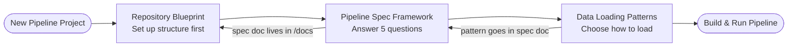

## Definition

Visual map of how the 3 Day 1 concepts relate and sequence in a real pipeline project.

## Flowchart

## Sequence

1. **Repository Blueprint** — agree on folder structure before writing any code
2. **Pipeline Spec Framework** — answer 5 questions to define the pipeline contract; output saved to `/docs/pipeline_specification.md`
3. **Data Loading Patterns** — Q1/Q2 answers from the spec determine which pattern to use

## Related

- [[repository-blueprint]]
- [[pipeline-spec-framework]]
- [[data-loading-patterns]]
