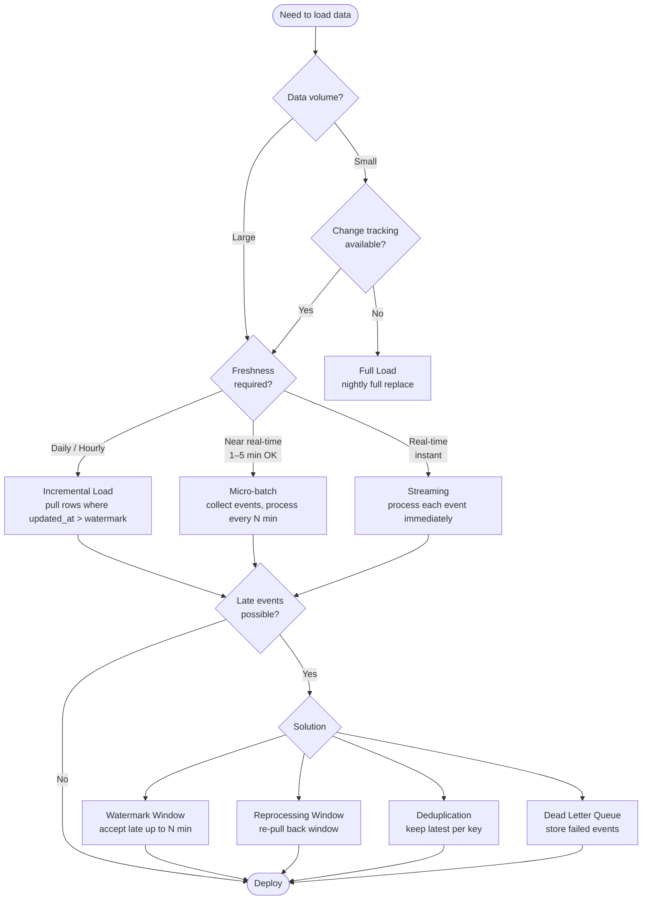

## Definition

Choose a loading pattern to match: **data freshness**, **data volume**, **system cost**, and **maintenance complexity**. Never choose based on tool familiarity alone.

## The 4 Patterns

| Pattern | What it does | Freshness | Use when |
|---------|-------------|-----------|----------|
| **Full Load** | Reload all data every run; replace destination | Per run (e.g. daily) | Small data, no change tracking available |
| **Incremental Load** | Load only new/changed rows since last run | Per run (e.g. hourly, daily) | Large data with timestamp or change tracking |
| **Micro-batch** | Collect events into small chunks, process every N minutes | 1–5 min intervals | Near-real-time needed but some latency OK |
| **Streaming** | Process event immediately as it arrives | Real-time / near-real-time | Must respond instantly (fraud, alerts, live tracking) |

## Full Load

- Drops and recreates destination every run
- Good for: first migration between systems, small reference tables (country, branch, product category), nightly report tables, sources with no way to detect changes
- Example: nightly pull of entire `customers` table from CRM → Data Warehouse (overwrite)

## Incremental Load

- Loads only rows where `updated_at > last_loaded_timestamp`
- Good for: daily/hourly sales, customer updates, stock changes, large tables where full reload is too expensive, periodic ETL jobs
- Example: every hour, pull orders where `updated_at > last_loaded_timestamp`

## Micro-batch

- Collects events into small chunks over a short window, then processes
- Good for: near-real-time dashboards, clickstream/event data, fraud detection with tolerable delay, IoT sensor summaries
- Example: every 5 min, pull payment events from queue → compute and update metrics

## Streaming

- Processes each event immediately as it arrives
- Good for: real-time fraud detection, live vehicle/rider tracking, stock/crypto prices, real-time recommendations, monitoring + alerts from logs/sensors
- Example: card swipe event → immediately compute + alert if anomalous behavior

## Watermark

**Watermark** = the marker of how far the system has loaded.

```sql
-- Previous round: updated_at = 2026-05-14 10:00
-- New round:
SELECT * FROM orders
WHERE updated_at > '2026-05-14 10:00'
```

## Late Event Problem

Data can be updated retroactively *after* the watermark has already passed.

- Example: loaded at 10:00, but at 10:05 an old order is modified
- Pure `updated_at > watermark` misses this

### Solutions

| Method | How |
|--------|-----|
| **Watermark Window** | Wait for late events; e.g. accept late events up to 10 min after window closes |
| **Reprocessing Window** | Re-pull a back window; `updated_at >= NOW() - INTERVAL '15 minutes'` |
| **Deduplication** | When overlap is loaded, keep only latest per key; `KEEP latest updated_at per order_id` |
| **Dead Letter Queue** | Store failed/malformed events separately for later review (schema errors, corrupted messages) |

## Key Principle for Streaming

Good streaming ≠ just fast. It must:
- Handle late events
- Support replay
- Deduplicate
- Allow audit

## Mini Exercise Answers (from Day 1)

| Scenario | Pattern | Key question |
|----------|---------|-------------|
| Daily sales export from ERP | Full Load or Incremental | How large? Can it be rolled back? |
| Access log requiring near-real-time alerts | Streaming or Micro-batch | Acceptable latency in minutes? |
| Inventory file uploaded every morning | Full Load or Incremental by file | What if file arrives late or with wrong name? |
| Customer profile with retroactive edits | Incremental with Overlap | Which field is the watermark? |
| Executive dashboard updated hourly | Incremental Load | — |
| Factory temperature sensor | Micro-batch or Streaming | — |
| Monthly finance ledger | Full Load | — |
| Mobile app clickstream | Micro-batch | — |
| Product catalog with intraday price edits | Incremental with Overlap | — |
| ML Feature Store for recommendations | Incremental or Micro-batch | — |
| HR data updated only when employee changes | Incremental (event-driven) | — |
| Partner SFTP file upload nightly | Full Load or Incremental by file | — |

## Flowchart



## Related

- [[pipeline-spec-framework]] — question 1 (ดึงจากไหน) and question 2 (เก็บที่ไหน) inform pattern choice
- [[repository-blueprint]] — load pattern documented in `/docs/pipeline_specification.md`
