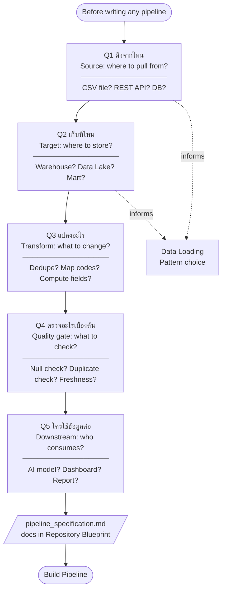

## Definition

Before writing any pipeline, answer 5 questions. The answers become the **Pipeline Specification** — the contract between engineers, stakeholders, and downstream consumers.

## The 5 Questions

| # | Thai | English |
|---|------|---------|
| 1 | ดึงจากไหน | Where to pull from (Source) |
| 2 | เก็บที่ไหน | Where to store (Target) |
| 3 | แปลงอะไร | What to transform |
| 4 | ตรวจอะไรเบื้องต้น | What to check first (Quality gate) |
| 5 | ใครใช้ข้อมูลต่อ | Who consumes data next (Downstream) |

## Required Output of the Spec

- Source, Target, key fields, and load frequency
- Cleaning rules and Transformation examples (before/after)
- Dependency, Retry, Logging, and Success criteria
- Known issues to hand off to Day 2 (Data Quality)

## Worked Example

| Dimension | Values |
|-----------|--------|
| **Source** | Inventory CSV File, Customer Master Database, Orders REST API |
| **Target** | `RAW.raw_orders` (PostgreSQL Warehouse), S3 Data Lake |
| **Transform** | Remove duplicate `order_id`; map status code → business meaning; compute `delivery_days` |
| **Quality checks** | Check duplicate `order_id`; check NULL `customer_id`; check data freshness |
| **Consumers** | AI Model, Executive Management Report, Operations Dashboard |

## Connection to Architecture Blueprint

Theory 1 goal: translate an architecture diagram into discrete, verifiable subtasks.
The spec card is the mechanism — each box in the diagram becomes answerable via these 5 questions.

## Flowchart

## Related

- [[repository-blueprint]] — where the spec document lives (`/docs/pipeline_specification.md`)
- [[data-loading-patterns]] — answers question 1/2 (how to pull and at what cadence)
