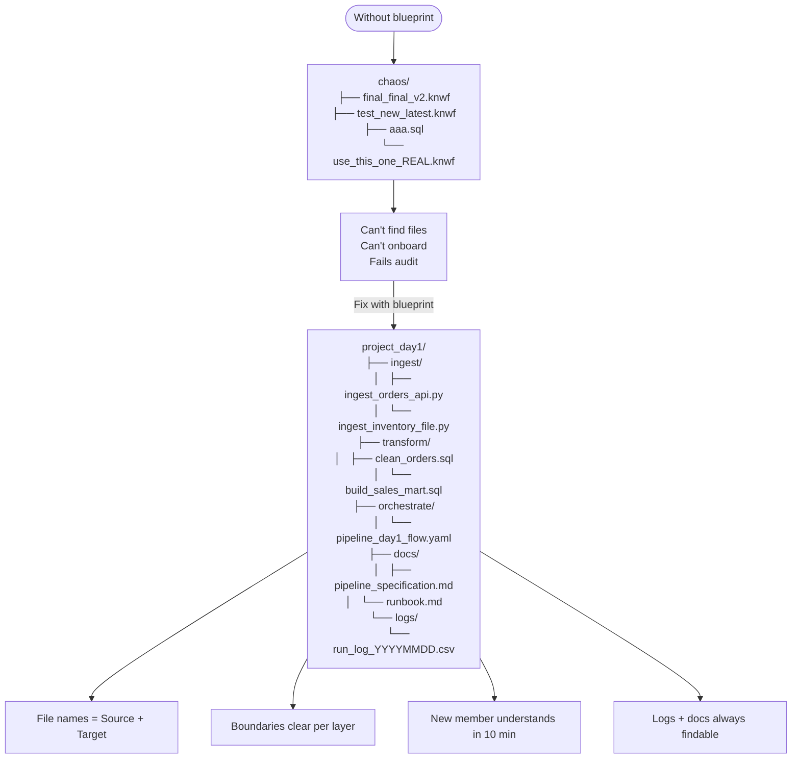

## Definition

A **Repository Blueprint** is the complete project structure plan — the agreed layout of files, folders, workflows, scripts, and documentation **before** pipeline development begins.

## Analogy

| Data Engineering | Construction |
|-----------------|--------------|
| Pipeline | ตัวอาคาร (the building) |
| Repository Blueprint | แบบแปลนอาคาร (architectural plan) |
| Workflow (KNIME) | ขั้นตอนการสร้างอาคาร (construction steps) |
| Folder Structure | องค์ประกอบอาคาร + วิธีสร้าง (components + method) |
| Logging / Docs | ระบบไฟ/ประปา/คู่มือ (utilities + manual) |

## Why It Matters

Without a blueprint, real projects end up like:
```
project/
├── final_final_v2.knwf
├── test_new_latest.knwf
├── temp2.csv
├── aaa.sql
└── use_this_one_final_REAL.knwf
```
Consequences: can't find workflows, hard to onboard new team, hard to rerun/debug, production support nightmare, fails governance/audit.

## Good Repository Structure

```
/project_day1
  /ingest
    ingest_orders_api.py
    ingest_customer_database.sql
    ingest_inventory_file.py
  /transform
    clean_orders.sql
    map_order_status.sql
    build_sales_mart.sql
  /orchestrate
    pipeline_day1_flow.yaml
  /docs
    pipeline_specification.md    ← output of [[pipeline-spec-framework]]
    runbook.md
  /logs
    run_log_YYYYMMDD.csv
```

## Rules

- Structure doesn't need to be complex — but **boundaries must be clear**
- File names should tell you Source and Target
- Logs and docs must be findable
- New team member should be able to read and understand within 10 minutes

## Flowchart



## Related

- [[pipeline-spec-framework]] — `pipeline_specification.md` lives in `/docs`
- [[data-loading-patterns]] — load strategy is documented in the spec
