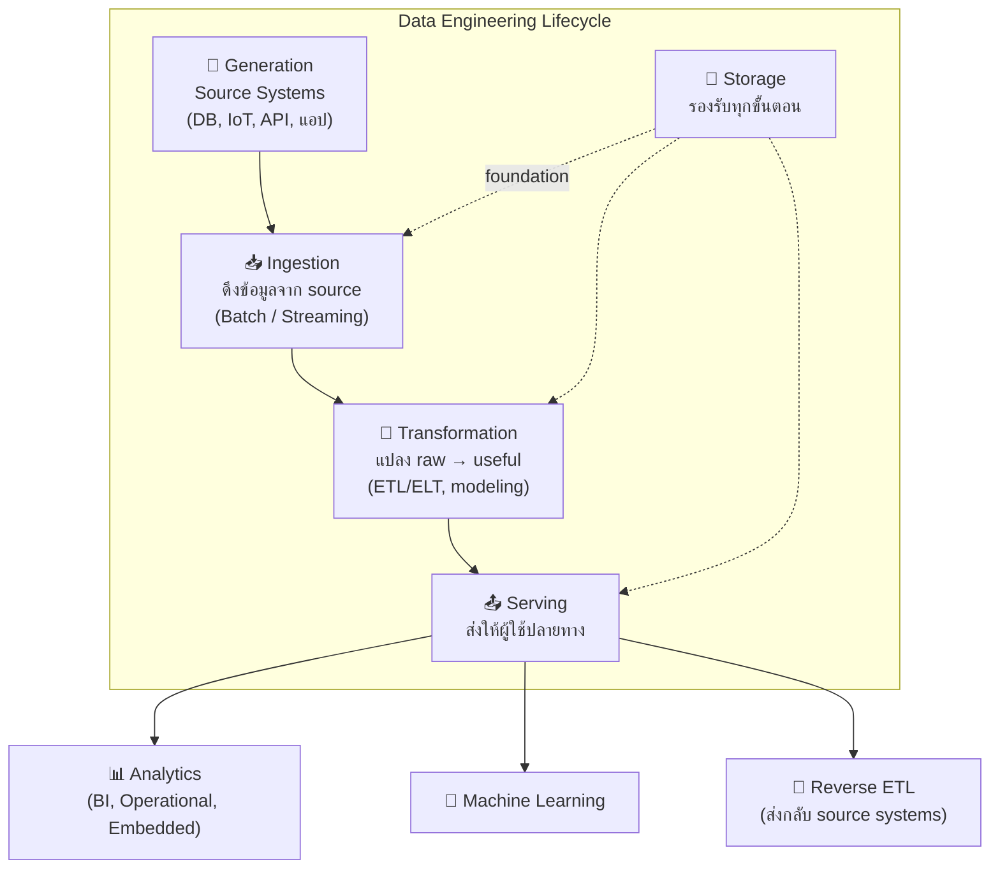
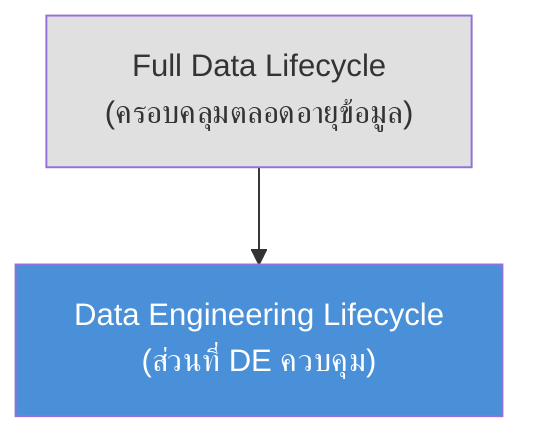
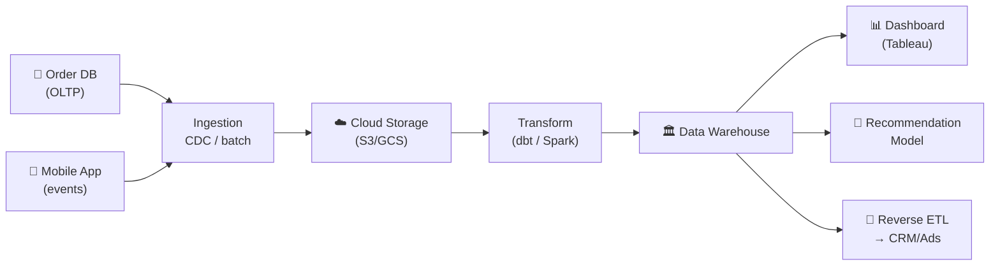

## Definition

**Data Engineering Lifecycle** คือ กรอบงาน (framework) ที่อธิบายเส้นทางการเดินทางของข้อมูลตั้งแต่ต้นทาง (source) จนถึงปลายทาง (serving) โดยมี 5 ขั้นตอนหลักและ undercurrents ที่วิ่งตลอด

> แนวคิดนี้ช่วยให้ Data Engineer มองภาพรวมงานตัวเองแทนที่จะมุ่งแต่ technology

---

## Details

### 5 ขั้นตอนหลัก

### Undercurrents

ส่วนที่วิ่งอยู่ตลอดทุกขั้นตอน — ขาดอันใดอันหนึ่งไม่ได้:

| Undercurrent | หน้าที่ |
|-------------|---------|
| **Security** | ควบคุมการเข้าถึง, encryption, least privilege |
| **Data Management** | governance, quality, metadata, lineage |
| **DataOps** | observability, monitoring, incident response |
| **Data Architecture** | trade-off analysis, design for agility |
| **Orchestration** | schedule jobs, coordinate workflows |
| **Software Engineering** | coding, testing, design patterns |

### Lifecycle vs Full Data Lifecycle

---

## Examples

**ตัวอย่าง E-commerce Pipeline:**

---

## Related

- [[fundamentals-of-data-engineering]] — source
- [[data-engineering-undercurrents]] — รายละเอียด undercurrents
- [[data-maturity-model]] — ระดับ maturity องค์กร
- [[data-loading-patterns]] — ingestion patterns
