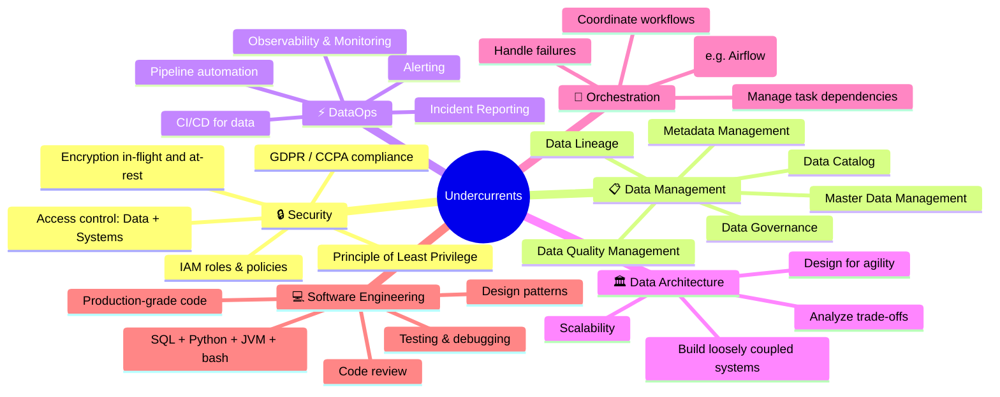
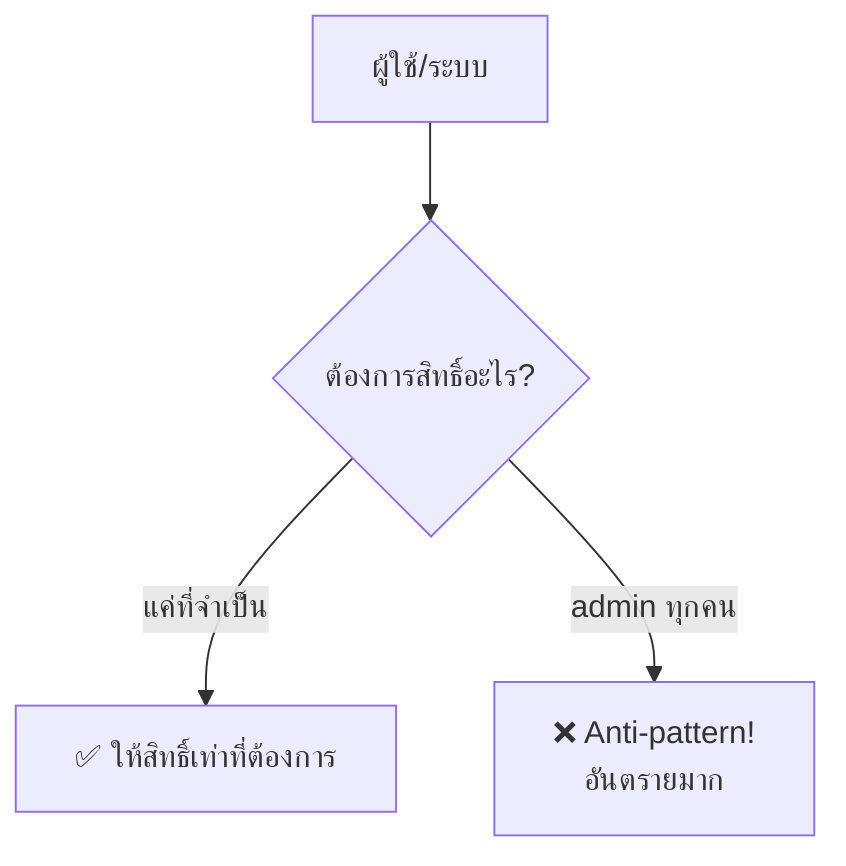
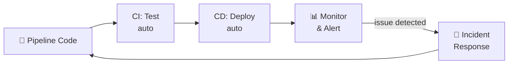
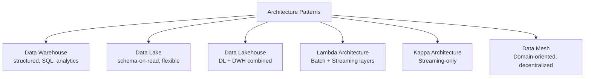
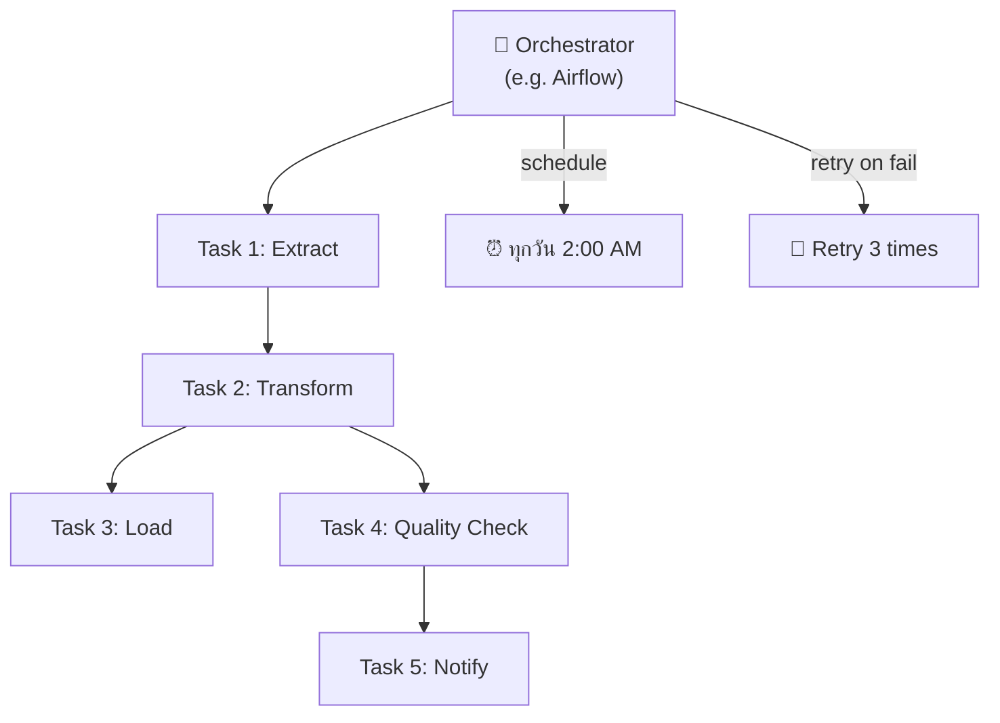

## Definition

**Undercurrents** (กระแสใต้น้ำ) คือ หลักปฏิบัติ 6 ด้านที่วิ่งอยู่ตลอดทุกขั้นตอนของ [[data-engineering-lifecycle]] ขาดอันใดอันหนึ่งแล้วระบบจะไม่สมบูรณ์

---

## Details

### ภาพรวม 6 Undercurrents

---

### 1. Security — ความปลอดภัย

> "Security must be top of mind for data engineers, and those who ignore it do so at their peril."

**Principle of Least Privilege**: ให้สิทธิ์แค่ที่จำเป็นสำหรับงาน ไม่มากกว่านั้น

**ประเภทความปลอดภัย:**
- Access control — ใครเข้าถึงข้อมูลอะไรได้
- Encryption — ทั้ง in-flight (ขณะส่ง) และ at-rest (ขณะเก็บ)
- IAM — Identity and Access Management
- Network security
- Compliance — GDPR, CCPA

---

### 2. Data Management — การจัดการข้อมูล

**DAMA DMBOK** definition:
> "Data management is the development, execution, and supervision of plans, policies, programs, and practices that deliver, control, protect, and enhance the value of data and information assets throughout their lifecycle."

**องค์ประกอบหลัก:**

| องค์ประกอบ | คืออะไร |
|-----------|---------|
| **Data Governance** | นโยบายและมาตรฐานการใช้ข้อมูล |
| **Data Quality** | ความถูกต้อง ครบถ้วน ทันสมัย |
| **Metadata Management** | ข้อมูลเกี่ยวกับข้อมูล (schema, lineage) |
| **Master Data Management** | ข้อมูลอ้างอิงกลาง (customer, product) |
| **Data Lineage** | ติดตามว่าข้อมูลมาจากไหน ผ่านอะไร |
| **Data Catalog** | แค็ตตาล็อกค้นหาข้อมูลในองค์กร |

---

### 3. DataOps — ปฏิบัติการข้อมูล

DataOps ยืมแนวคิดจาก DevOps มาใช้กับ data pipelines:

**เป้าหมาย DataOps:**
- Observability — มองเห็นได้ว่า pipeline ทำงานอย่างไร
- เตือนเมื่อมีปัญหา
- ลด time-to-detect และ time-to-resolve

---

### 4. Data Architecture — สถาปัตยกรรมข้อมูล

**9 Principles of Good Data Architecture** (จาก Ch. 3):
1. Choose common components wisely
2. Plan for failure
3. Architect for scalability
4. Architecture is leadership
5. Always be architecting
6. Build loosely coupled systems
7. Make reversible decisions
8. Prioritize security
9. Embrace FinOps

**Architecture patterns ที่สำคัญ:**

---

### 5. Orchestration — การประสานงาน

Orchestration = "ผู้ควบคุมวง" ของ data pipelines

---

### 6. Software Engineering — การพัฒนาซอฟต์แวร์

ภาษาที่ Data Engineer ต้องรู้:

| ภาษา | ใช้ทำอะไร |
|-----|----------|
| **SQL** | lingua franca ของ data, analytics, transformation |
| **Python** | glue language, Airflow, pandas, PySpark |
| **JVM (Java/Scala)** | Apache Spark, Flink, Hive |
| **bash** | scripting, CLI operations, automation |

---

## Related

- [[data-engineering-lifecycle]] — lifecycle ที่ undercurrents รองรับ
- [[fundamentals-of-data-engineering]] — source
- [[data-maturity-model]] — undercurrents ซับซ้อนขึ้นตาม maturity
