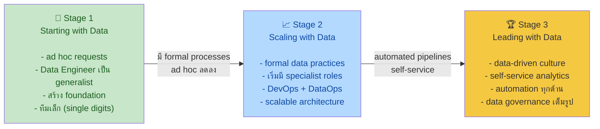

## Definition

**Data Maturity** = ระดับความก้าวหน้าในการใช้ข้อมูลขององค์กร ไม่ได้วัดจากอายุหรือรายได้ แต่วัดจาก **วิธีที่องค์กรใช้ข้อมูลเป็น competitive advantage**

---

## Details

### 3 ระดับของ Data Maturity

---

### Stage 1: Starting with Data

**บริบท:** องค์กรเพิ่งเริ่มต้นกับข้อมูล เป้าหมายยังไม่ชัด

**สิ่งที่ DE ควรทำ:**
- Get buy-in จาก executive (ต้องมี sponsor)
- Define data architecture (มักทำคนเดียว ไม่มี Data Architect แยก)
- สร้าง solid data foundation — อย่ารีบ ML
- Quick wins เพื่อให้องค์กรเห็นคุณค่าของข้อมูล

**⚠️ Pitfalls:**

---

### Stage 2: Scaling with Data

**บริบท:** มี formal data practices แล้ว กำลังขยายสู่ data-driven organization

**สิ่งที่ DE ควรทำ:**
- Establish formal data practices
- Create scalable and robust architectures
- Adopt DevOps and DataOps practices
- Build systems that support ML
- Roles เริ่มแยกเป็น specialist

**⚠️ Pitfalls:**
- อย่าตามกระแส Silicon Valley — เลือก tech ที่ deliver value จริง
- Bottleneck อยู่ที่ **ทีม** ไม่ใช่ tech
- อย่าทำตัวเป็น "data genius" — สอนองค์กรให้ใช้ข้อมูลด้วย

---

### Stage 3: Leading with Data

**บริบท:** องค์กร data-driven อย่างเต็มตัว ทุกทีมใช้ข้อมูลเป็นรูทีน

**สิ่งที่ DE ควรทำ:**
- Automation สำหรับ data introduction
- Custom tools ที่เป็น competitive advantage
- Data governance + quality + DataOps เต็มรูปแบบ
- Data catalog, lineage tools, metadata systems
- สร้าง community ที่ทุกคนพูดเรื่อง data ได้

**⚠️ Pitfalls:**
- **Complacency** — ถึง stage 3 แล้วนิ่งนอนใจ → ตกกลับไป stage ต่ำได้
- Expensive "hobby projects" ที่ไม่ deliver business value

---

### DE Role เปลี่ยนตาม Maturity

| Stage | DE เป็นอะไร | Focus หลัก |
|-------|-----------|-----------|
| 1 | Generalist | Move fast, สร้าง foundation |
| 2 | Specialist | Scalability, formal practices |
| 3 | Deep specialist | Automation, governance, competitive tools |

---

## Examples

- Startup ที่เพิ่งตั้ง = Stage 1 (แม้อายุน้อยก็ได้)
- บริษัทร้อยปีที่ยังทำ ad hoc Excel = Stage 1
- Netflix, Uber, Airbnb = Stage 3

---

## Related

- [[data-engineering-lifecycle]] — lifecycle ที่ซับซ้อนขึ้นตาม maturity
- [[data-engineering-undercurrents]] — undercurrents ต้องการมากขึ้นใน Stage 2-3
- [[fundamentals-of-data-engineering]] — source
