## Summary

หนังสือเล่มนี้เป็น **คู่มือหลัก** ของวิชา Data Engineering ที่ไม่ยึดติดกับ tool ใดเครื่องมือหนึ่ง แต่สอน **หลักคิด (principles)** ที่คงทนต่อเวลา แกนกลางของหนังสือคือ **Data Engineering Lifecycle** — กรอบงานที่ช่วยให้วิศวกรข้อมูลมองภาพรวมของงานตัวเองได้ครบ

> ผู้เขียนเปรียบตัวเองว่าเป็น "recovering data scientists" — เคยทำ Data Science แต่ติดปัญหาเรื่อง infrastructure จึงหันมาสนใจ Data Engineering อย่างจริงจัง

The book is organized into three parts:
- **Part I** — Foundation & Building Blocks (Ch.1–4): definitions, lifecycle, architecture, tech selection
- **Part II** — Lifecycle in Depth (Ch.5–9): each stage has its own chapter
- **Part III** — Security, Privacy & Future (Ch.10–11)

---

## Key Concepts

### 1. What Is Data Engineering?

**Data engineering** คือ การพัฒนา ดูแล และบำรุงรักษาระบบและกระบวนการ ที่รับข้อมูลดิบ (raw data) แล้วผลิตข้อมูลคุณภาพสูงออกมาเพื่อ use cases ปลายทาง เช่น analytics และ machine learning

> *"Data engineering is the development, implementation, and maintenance of systems and processes that take in raw data and produce high-quality, consistent information that supports downstream use cases."*

**Data Engineer คือ** คนที่จัดการ Data Engineering Lifecycle ตั้งแต่รับข้อมูลจาก source systems จนถึงส่งข้อมูลให้ใช้งาน

Data Engineering อยู่ **upstream** จาก Data Science:

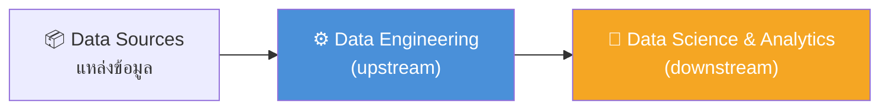

---

### 2. The Data Engineering Lifecycle

**วงจรชีวิตของ Data Engineering** — หัวใจหลักของหนังสือ มี 5 ขั้นตอน:

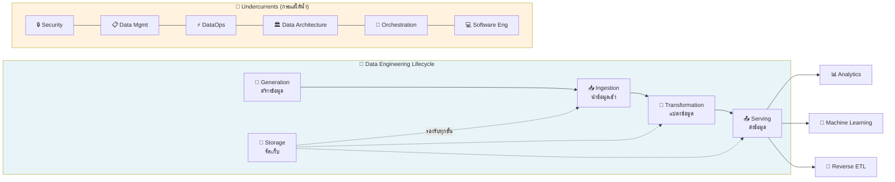

**อธิบายแต่ละขั้น:**

| Stage | ภาษาไทย | คำอธิบาย |
|-------|---------|----------|
| **Generation** | สร้างข้อมูล | Source systems — DB, IoT, API, แอป |
| **Storage** | จัดเก็บ | รองรับทุกขั้นตอน ตลอด lifecycle |
| **Ingestion** | นำข้อมูลเข้า | ดึงข้อมูลจาก source เข้าสู่ระบบ |
| **Transformation** | แปลงข้อมูล | เปลี่ยน raw → ข้อมูลที่มีประโยชน์ |
| **Serving** | ส่งข้อมูล | ส่งให้ analytics, ML, Reverse ETL |

> ⚠️ **สิ่งสำคัญ:** Storage ไม่ใช่แค่ขั้นตอนหนึ่ง — มันรองรับทุกขั้น ข้อมูลผ่านการจัดเก็บตลอดเส้นทาง

---

### 3. Undercurrents — กระแสใต้น้ำ

สิ่งที่วิ่งอยู่ใต้ทุกขั้นตอนของ lifecycle ขาดไม่ได้:

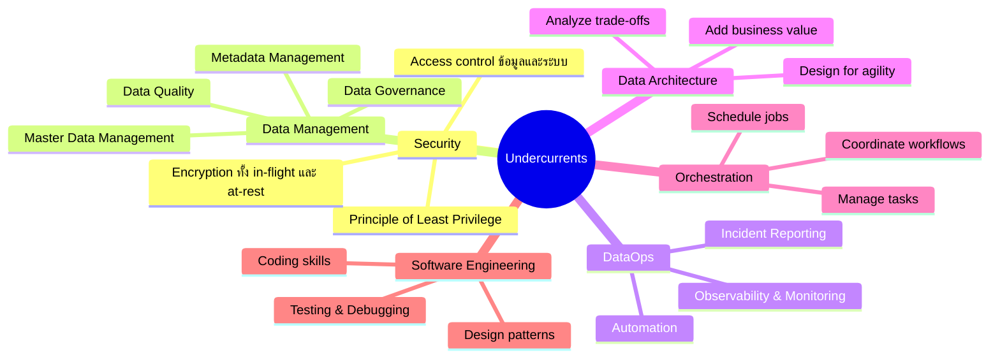

---

### 4. Generation — Source Systems

**Source System** = แหล่งกำเนิดข้อมูล เช่น:
- Application databases (OLTP)
- IoT devices / sensors
- Message queues
- SaaS platforms
- Files และ APIs

**คำถามที่ต้องถามเกี่ยวกับ Source System:**

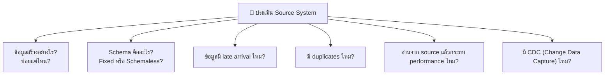

---

### 5. Storage — การจัดเก็บข้อมูล

**Data Temperature** — อุณหภูมิของข้อมูล บอกความถี่ในการเข้าถึง:

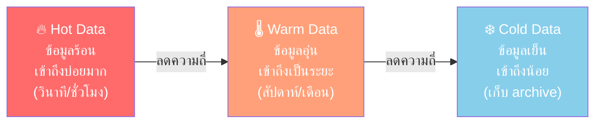

**ประเภท Storage Abstractions:**

| ประเภท | คืออะไร |
|--------|---------|
| **Data Warehouse** | ข้อมูล structured สำหรับ analytics, schema บังคับ |
| **Data Lake** | เก็บทุกรูปแบบ, schema-on-read, ยืดหยุ่น |
| **Data Lakehouse** | ผสม Lake + Warehouse |
| **Data Platform** | ครบวงจร, ทั้ง storage + compute + governance |

---

### 6. Ingestion — การนำข้อมูลเข้า

**Batch vs Streaming:**

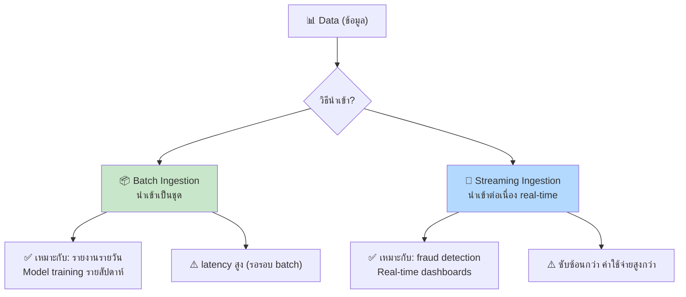

**Push vs Pull:**

| Pattern | คืออะไร | ตัวอย่าง |
|---------|---------|---------|
| **Push** | Source ส่งข้อมูลมาให้เรา | CDC log-based, Webhook |
| **Pull** | เราไปดึงข้อมูลจาก source | ETL extract, REST API polling |

---

### 7. Transformation — การแปลงข้อมูล

**ETL vs ELT:**

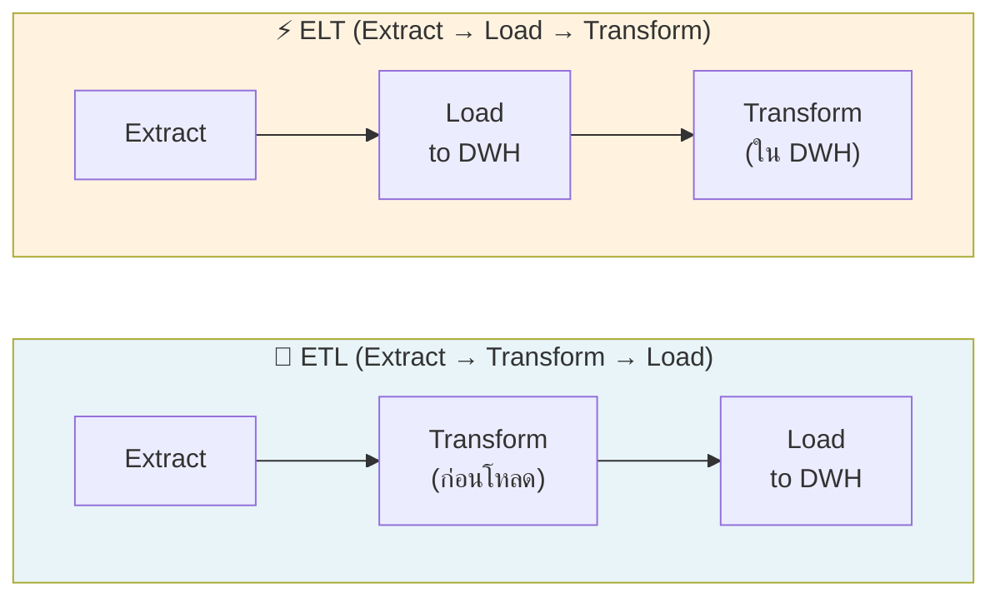

**Transformation ทำอะไรบ้าง:**
- แปลง data types (string → date, number)
- ทำ normalization / denormalization
- Business logic — "sale = someone bought X for $Y"
- Feature engineering สำหรับ ML
- Data cleaning และ deduplication

---

### 8. Serving Data — การส่งข้อมูล

**3 ประเภทของ Analytics:**

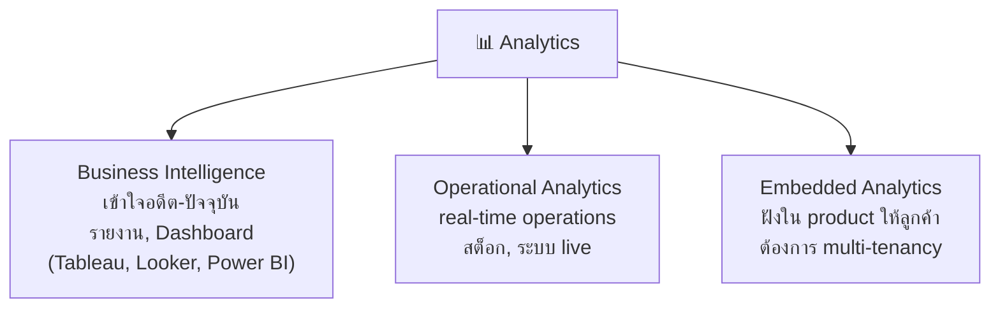

**Reverse ETL** — ส่งข้อมูลกลับสู่ source systems:

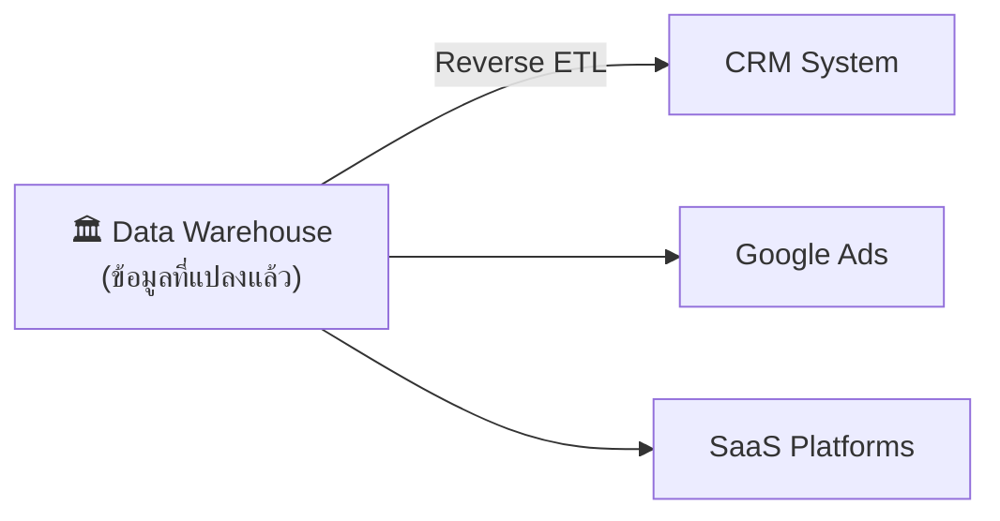

> ตัวอย่าง: คำนวณ bid ใน data warehouse แล้วส่งกลับไปที่ Google Ads โดยอัตโนมัติ

---

### 9. Data Maturity Model — ระดับความสุกของข้อมูลในองค์กร

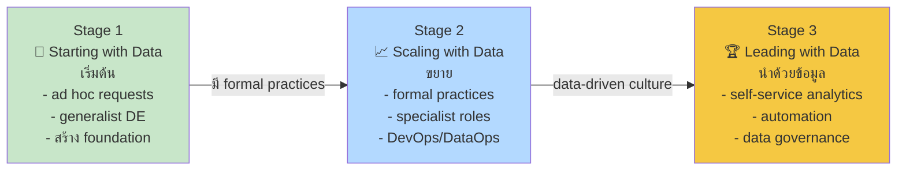

**คำแนะนำในแต่ละ Stage:**

| Stage | หลีกเลี่ยง | ควรทำ |
|-------|-----------|-------|
| Stage 1 | กระโดดไป ML เร็วเกินไป | สร้าง data foundation ก่อน |
| Stage 2 | ใช้ bleeding-edge tech ตาม hype | เลือก tech ที่ deliver value จริง |
| Stage 3 | ทำ vanity projects | รักษา maintenance + governance |

---

### 10. Type A vs Type B Data Engineers

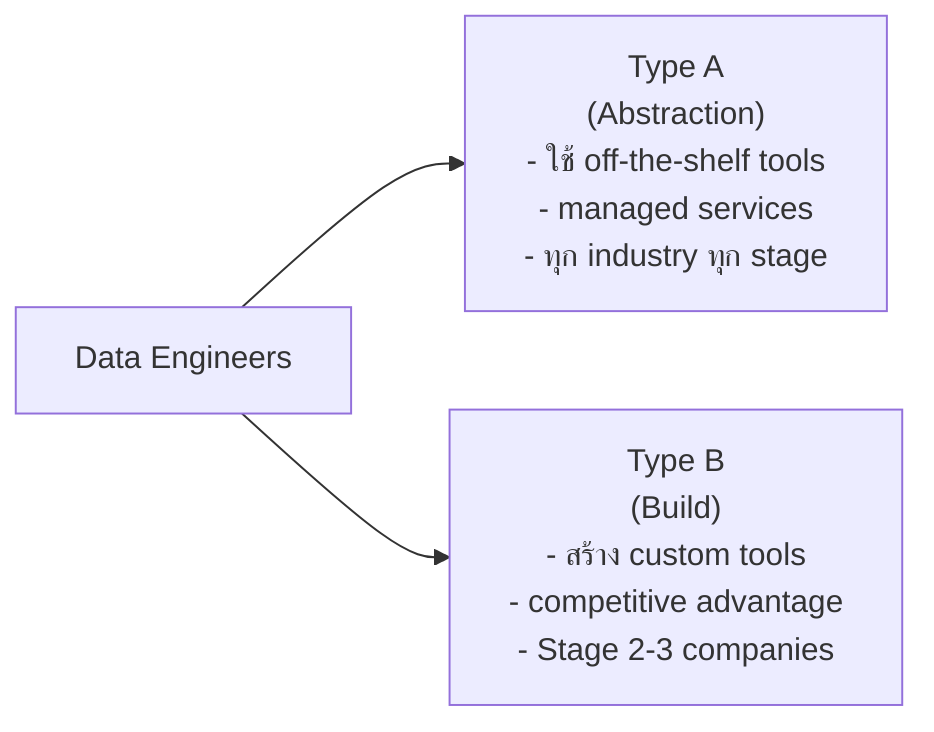

---

### 11. Data Engineer ทำงานกับใคร?

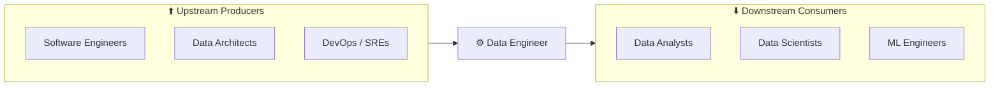

**ผู้บริหารที่ DE ทำงานด้วย:**
- **CIO** — IT strategy, data culture
- **CTO** — tech strategy, external systems
- **CDO** — data assets & strategy
- **CAO** — analytics & decision-making

---

## Notes / Observations

- หนังสือเน้น **cloud-first approach** — ถือว่า infrastructure เป็น ephemeral และ scalable
- **"What's old is new again"** — pattern เก่าๆ (data governance, data management) กลับมาใหม่ในยุค modern data stack
- Data Science Hierarchy of Needs: **70-80% ของเวลา data scientist ใช้ไปกับ bottom 3 layers** (collect, move/store, explore/transform) — นี่คืองานของ Data Engineer
- ภาษาหลักที่ DE ต้องรู้: **SQL, Python, JVM (Java/Scala), bash**
- SQL ยังคงสำคัญมาก — "The Unreasonable Effectiveness of SQL"
- **คำเตือน:** อย่าสร้าง "vanity data projects" — เก็บข้อมูลเยอะแต่ไม่มีใครใช้ ข้อมูลที่ไม่ถูก consume คือ "inert" ไม่มีคุณค่า
- Orchestration tools เช่น **Apache Airflow** ถูกพูดถึงบ่อย

---

## Related Concepts

- [[data-engineering-lifecycle]] — รายละเอียดเต็มของ lifecycle
- [[data-engineering-undercurrents]] — Security, DataOps, Orchestration
- [[data-maturity-model]] — 3 stages model
- [[data-loading-patterns]] — เชื่อมกับ ingestion patterns จาก Day 1
- [[pipeline-spec-framework]] — การออกแบบ pipeline จาก Day 1
